# Sign Language Learning and Practice Platform

A real-time sign language recognition application built with React and MediaPipe that enables users to learn, practice, and test their sign language skills. This platform uses advanced machine learning algorithms to recognize American Sign Language (ASL) gestures in real-time through webcam input.

## Overview

This application revolutionizes sign language communication by providing an interactive learning platform for people of all ages and skill levels. The platform recognizes 26 alphabets and 16 commonly used ASL words with high accuracy through real-time gesture detection and instant visual feedback.

## Key Features

Real-Time Gesture Recognition: Instantaneous recognition of hand gestures using MediaPipe's advanced hand tracking and gesture recognition models.

Interactive Learning System: Three-tier learning approach with guided instruction, hands-on practice, and assessment testing.

Real-Time Progress Tracking: Comprehensive dashboard showing total signs practiced, test scores, and performance metrics.

Adaptive Learning: Smart detection system that improves recognition accuracy through continuous learning and user interaction.

User Authentication: Secure Google OAuth integration for personalized user accounts and progress tracking.

Confidence Scoring: Visual feedback showing detection confidence percentage to help users improve their technique.

Responsive Interface: Intuitive and accessible user interface designed for users of all technical skill levels.

Performance Analytics: Detailed performance summaries with accuracy metrics, time tracking, and strength/weakness analysis.

## Technical Architecture

### Front-End Stack

React: Modern JavaScript library for building interactive user interfaces

Redux: State management for predictable application state

React Router: Client-side routing for seamless navigation

Webcam Integration: Real-time video capture and processing

## Back-End Stack

Supabase: PostgreSQL database with real-time capabilities for user data and feedback storage

Google OAuth: Secure authentication and user identity management

## Machine Learning Framework

MediaPipe: Google's powerful framework for building perception pipelines, providing pre-built hand tracking and gesture recognition models

Hand Detection: Dual-hand support for recognizing two-handed signs

Gesture Recognition: Custom-trained model recognizing 26 alphabets and 16 ASL words

## Installation and Setup

### Prerequisites

Node.js and npm installed on your system
A Supabase account and project
Google OAuth credentials
Modern web browser with webcam access

### Installation Steps

1. Clone the repository
   ```bash
   git clone https://github.com/NiteeshGowda72/sign-language-learning-platform.git
   cd sign-language-learning-platform
   ```

2. Install dependencies
   ```bash
   npm install
   ```

3. Configure environment variables
   Create a `.env` file in the root directory with the following variables:
   ```
   REACT_APP_SUPABASE_URL=your_supabase_url
   REACT_APP_SUPABASE_KEY=your_supabase_anon_key
   REACT_APP_GOOGLE_CLIENT_ID=your_google_client_id
   ```

4. Start the development server
   ```bash
   npm start
   ```

5. Open your browser and navigate to http://localhost:3000

## Application Features and Workflow

### Home Page

Welcome screen with options to choose between Practice and Test learning modes.

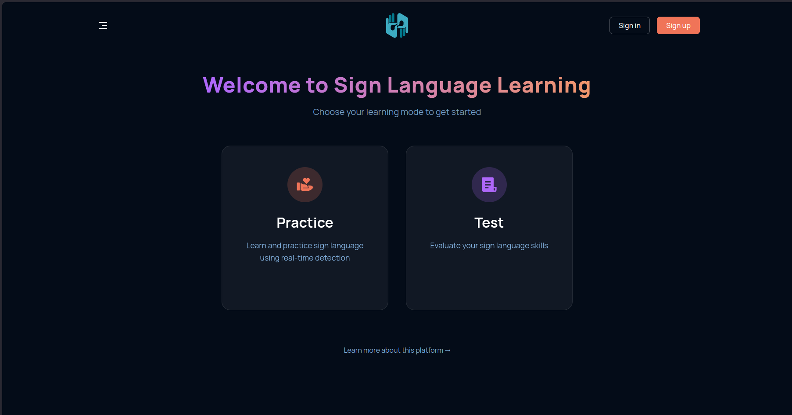

### User Registration

User account creation page with Google OAuth integration for seamless signup.

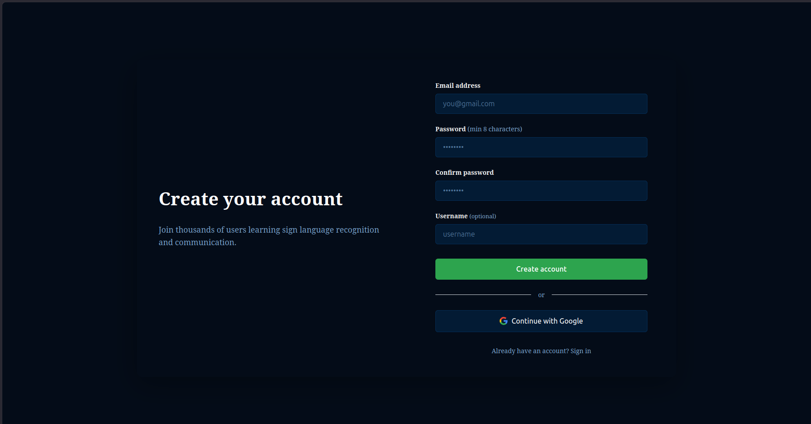

### User Login

Secure login interface with email and password authentication or Google login option.

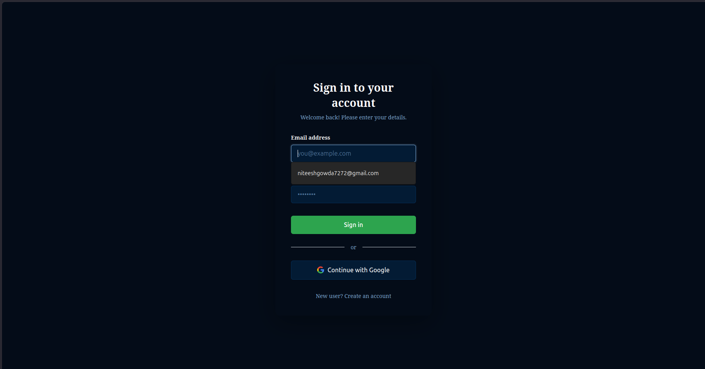

### Practice Mode Instructions

Clear instructions for the practice session with timing requirements and success criteria.

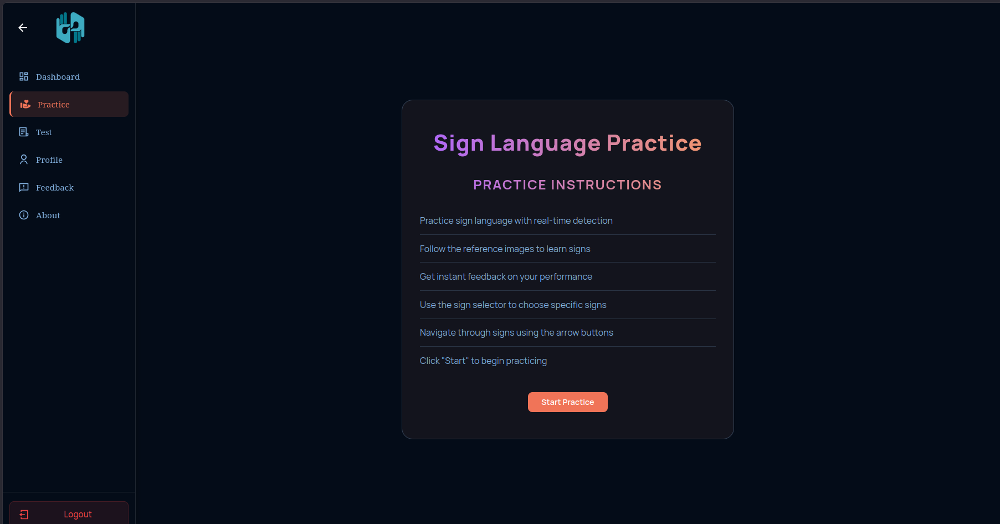

### Practice Mode – Sign "C" Detection in Progress

Live webcam feed with hand gesture visualization, real-time sign detection showing countdown timer.

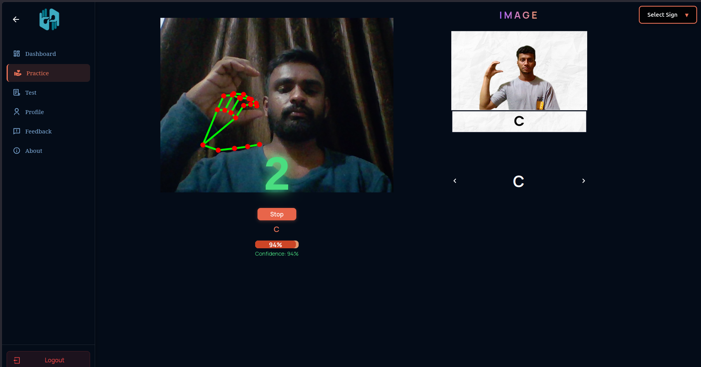

### Practice Mode – Sign "Thank You" Recognition

Practice mode gesture recognition showing the Thank You sign.

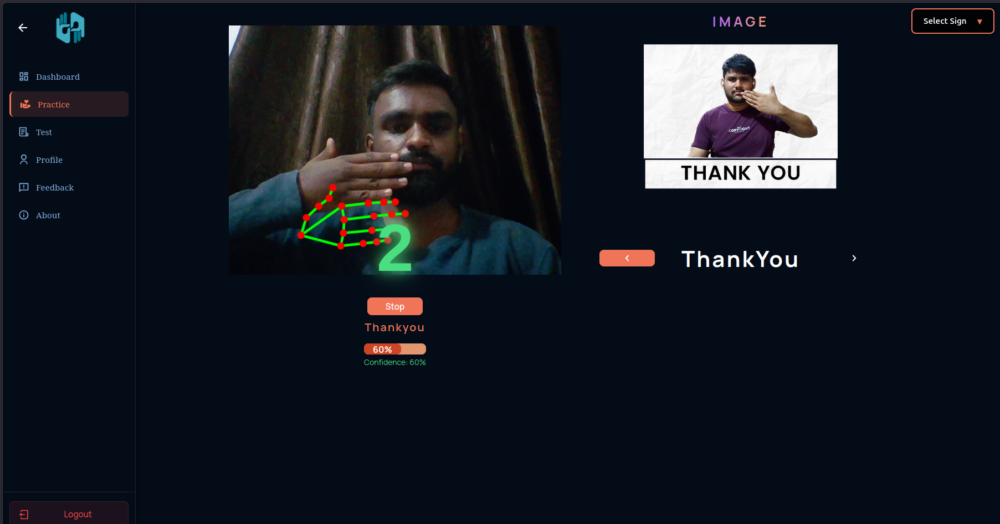

### Practice Mode – Sign "Bye" Recognition

Practice mode gesture recognition showing the Bye sign.

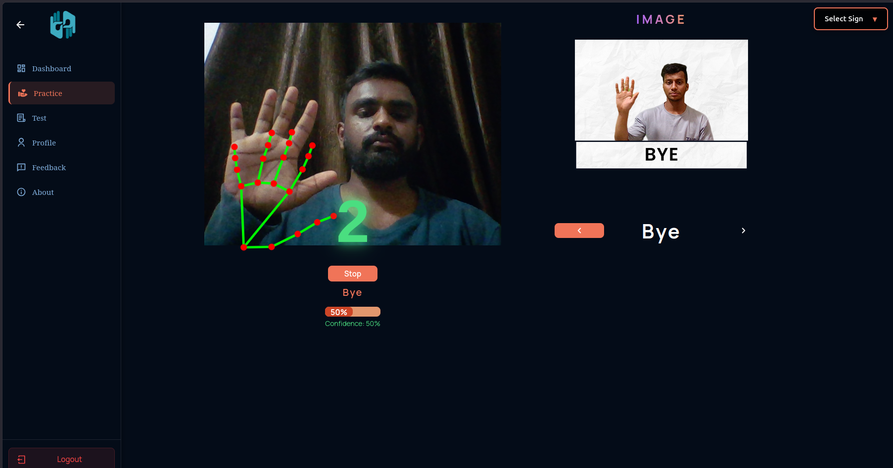

### Practice Mode – Sign "E" Successfully Completed

Practice mode confirmation screen showing successful sign completion for a selected gesture.

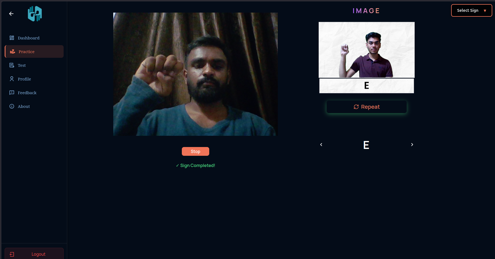

### Test Instructions

Detailed instructions for the 10-sign test with timing requirements and success criteria.

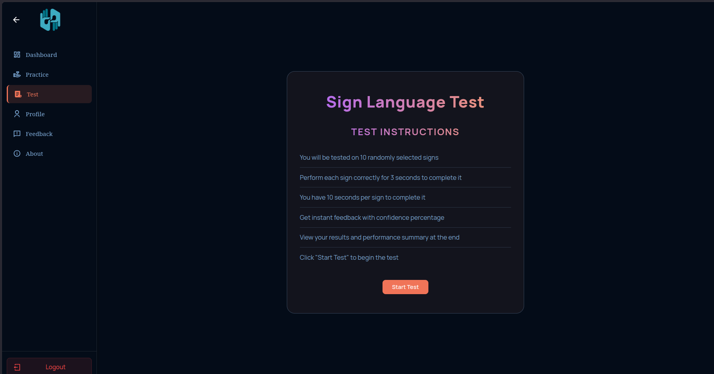

### Sign Language Test Interface

Organized test interface showing 10 signs to practice with real-time detection and completion tracking.

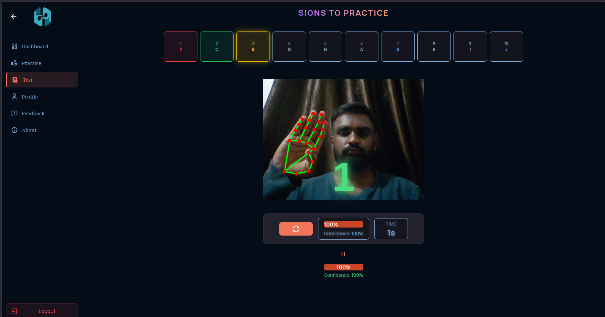

### Dashboard & Activity Analytics

User activity dashboard showing performance analytics and progress statistics.

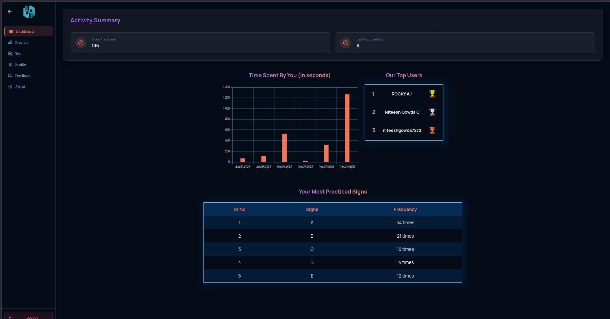

### User Profile

Comprehensive profile page displaying user information, account details, and progress statistics including total signs practiced, tests taken, best score, and accuracy metrics.

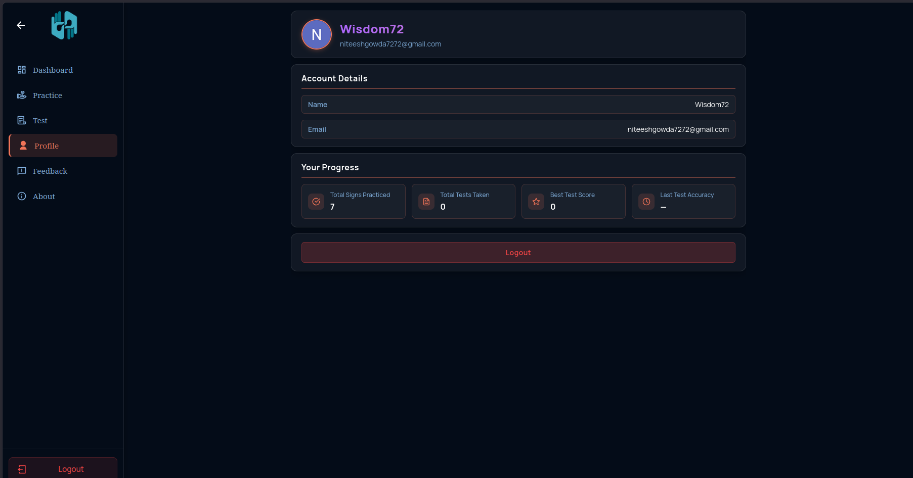

## Project Technology Stack

### Frontend Dependencies

@mediapipe/drawing_utils: Utilities for visualizing hand landmarks
@mediapipe/hands: Hand detection and tracking
@mediapipe/tasks-vision: Vision task framework
@react-oauth/google: Google authentication
@supabase/supabase-js: Supabase client library
chart.js and react-chartjs-2: Data visualization
react-redux: Redux bindings for React
react-router-dom: Client-side routing
react-webcam: Webcam component
uuid: Unique identifier generation
react-toastify: Notification system

## Developer Information

Developer: Niteesh Gowda C
Email: niteeshgowda7272@gmail.com
GitHub: https://github.com/NiteeshGowda72

## Project Repository

GitHub Repository: https://github.com/NiteeshGowda72

## Reference Documentation

MediaPipe Gesture Recognition: https://developers.google.com/mediapipe/solutions/vision/gesture_recognizer

Supabase Documentation: https://supabase.com/docs

Google OAuth Documentation: https://developers.google.com/identity/protocols/oauth2

## File Structure

The model training file is located in the root folder. The pre-trained gesture recognition model (sign_language_recognizer_25-04-2025.task) is located in the src/assests directory.

Model File: `src/assests/sign_language_recognizer_25-04-2025.task`

## License

This project is provided as-is for educational and research purposes.

## Acknowledgements

Special thanks to the open-source community for the tools and libraries that made this project possible.

- React: https://react.dev/
- MediaPipe: https://developers.google.com/mediapipe
- Supabase: https://supabase.com/
- Google OAuth: https://developers.google.com/identity/protocols/oauth2
